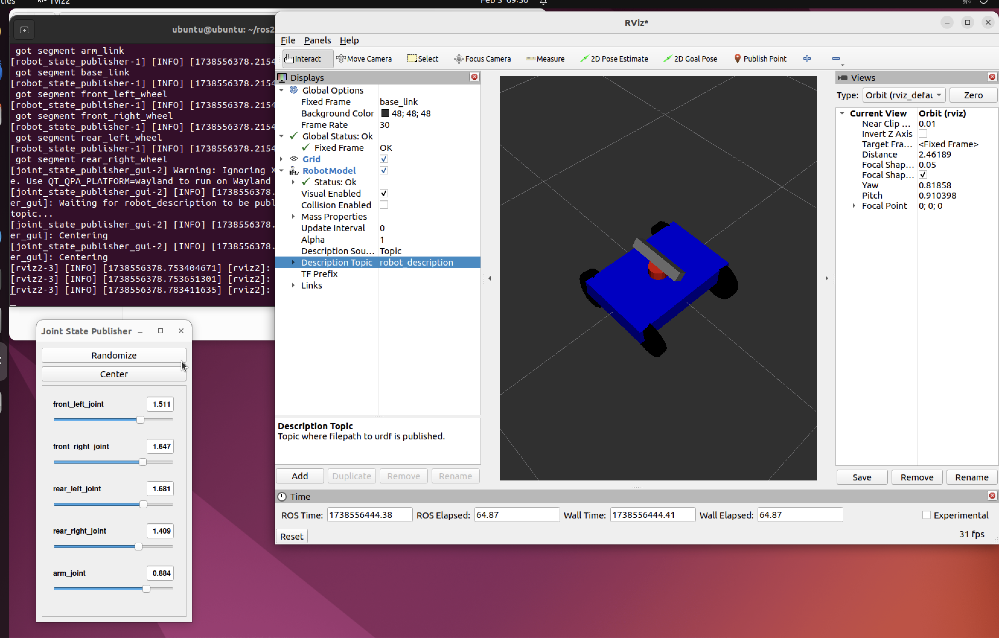

# **ROS2 Robot Model (URDF)**  

This repository contains the implementation of a **robot model** using **URDF (Unified Robot Description Format)** for simulation and visualization in **RViz** using **ROS 2**. The robot model is created to facilitate tasks in **robotics simulation** and can be used for various applications in **robot motion planning**, **control**, and **sensors integration**.

## **Project Overview**  
This project focuses on building a realistic robot model using ROS2, which can be visualized in RViz and later integrated into robotic applications, including control, motion planning, and sensor data visualization.

## **Technologies Used**
- **ROS2** (Robot Operating System 2)
- **URDF** (Unified Robot Description Format)
- **RViz** (Robot Visualization Tool)
- **ROS2 Packages**: `ros2_control`, `robot_state_publisher`, `joint_state_publisher`, etc.

## **Features**
- Robot model created using **URDF** for simulation and visualization.
- **RViz** integration for real-time visualization and control.
- Configurable robot joints and sensors for simulation.
- Ability to test robot movements in a simulated environment.

## **Installation**  

1. **Install ROS 2**  
   Follow the official ROS 2 installation guide based on your platform:  
   [ROS 2 Installation Guide](https://docs.ros.org/en/foxy/Installation.html)  

2. **Clone the Repository**  
   Clone this repository into your ROS 2 workspace:  
   ```bash
   cd ~/ros2_ws/src
   git clone https://github.com/yourusername/ros2_robot_model.git

3. **Build the Workspace  : Build your ROS 2 workspace:**
   cd ~/ros2_ws
   colcon build --symlink-install
   
4.	**Source the Workspace
     Source the workspace setup file:**
  	source install/setup.bash
5. **Launch the Robot Model in RViz
     After building the workspace, launch the robot model:**
    ros2 launch my_robot_description display_urdf.launch.py

**Visualize the Robot in RViz**
**Open RViz to visualize the robot model and move its joints using the sliders in the Robot Model display. Make sure to have the proper TF frames set up for the model.**


